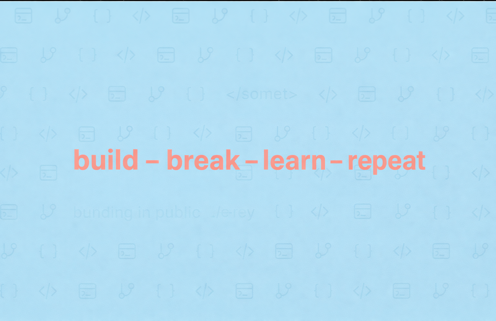

# 💫 About Me:
💫 About Me: 🔭 I’m currently working on Building and maintaining server & network environment.  🌱 I’m currently learning Enterprise networking basics, firewall management, network monitoring, and cybersecurity — along with Windows Server, Active Directory, Microsoft Defender, and Azure.  🎓 I’m a student Learning IT and networking through hands-on projects.  ⚡ Fun fact I run my own physical server and enjoy learning by building things myself.  📜 Certifications Microsoft MS-900 and AZ-900 certified.

# 💻 Tech Stack:
            
# 📊 GitHub Stats:
 
 

---

<!-- Proudly created with GPRM ( https://gprm.itsvg.in ) -->
